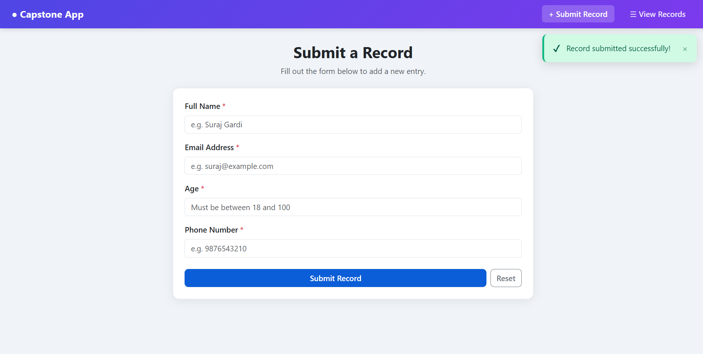
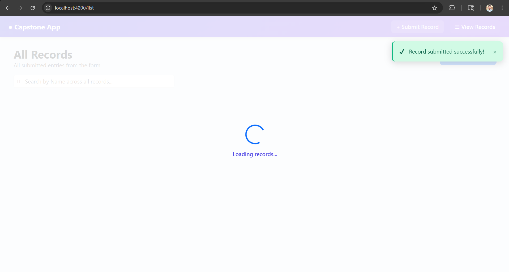
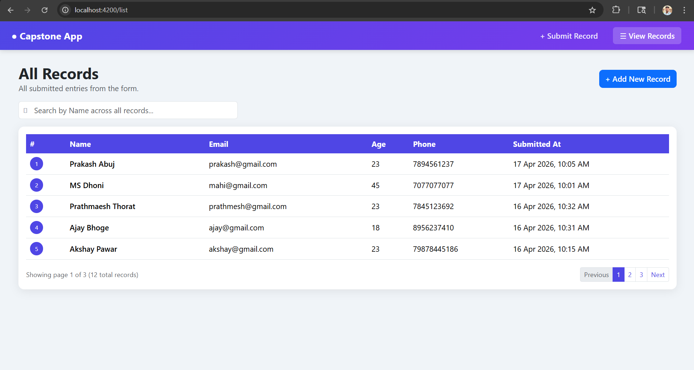
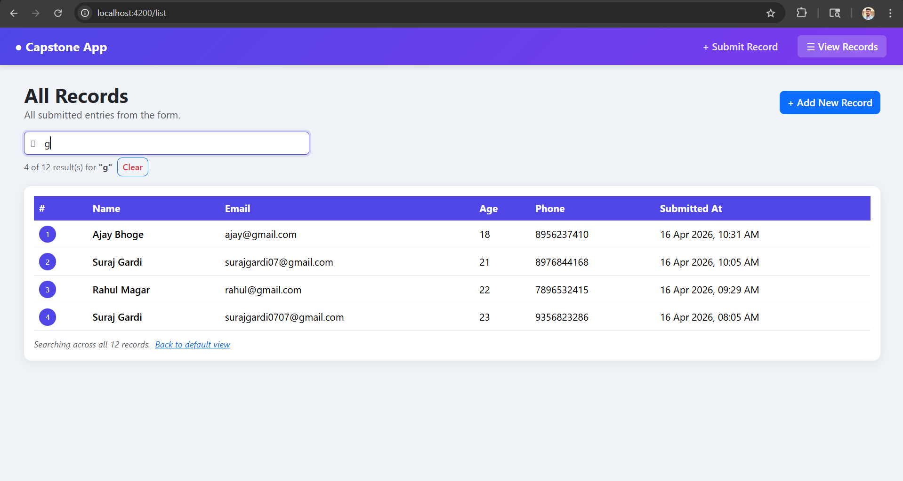

# 🚀 Angular + Django Capstone Project

> **Full-Stack Web Application** — Angular 14 Frontend with Django REST Framework Backend, PostgreSQL Database, Custom Middleware, Real-time Search, and Pagination.

---

## 📌 Repository Info

| Field | Value |
|---|---|
| **Repo Name** | `angular-django-capstone` |
| **Description** | Full-stack capstone project built with Angular 14 and Django REST Framework. Features a reactive form with validation, paginated data listing, live search across all records, custom Django middleware, and PostgreSQL database integration. |
| **Topics / Tags** | `angular` `django` `django-rest-framework` `postgresql` `full-stack` `capstone` `typescript` `python` `rest-api` `reactive-forms` |
| **Visibility** | Public |

---

## 📁 Project Structure

```
angular-django-capstone/
│
├── backend/                          # Django Backend
│   ├── capstone_backend/
│   │   ├── settings.py               # Django settings (DB, CORS, Middleware)
│   │   ├── urls.py                   # Root URL config
│   │   └── wsgi.py
│   ├── records/
│   │   ├── models.py                 # Record model (name, email, age, phone)
│   │   ├── serializers.py            # DRF serializer with validation
│   │   ├── views.py                  # GET + POST API views with pagination
│   │   ├── middleware.py             # Custom request logger middleware
│   │   └── urls.py                   # App-level URL routes
│   ├── manage.py
│   └── requirements.txt
│
└── capstone-frontend/                # Angular 14 Frontend
    └── src/
        └── app/
            ├── components/
            │   ├── navbar/            # Reusable navigation bar
            │   ├── alert-message/     # Reusable alert component
            │   ├── record-table/      # Reusable table (accepts startIndex)
            │   ├── pagination/        # Reusable pagination component
            │   ├── toast/             # Toast notification service + component
            │   └── loader/            # Full-screen loading overlay
            ├── pages/
            │   ├── form-page/         # Reactive form page
            │   └── list-page/         # Records listing with search + pagination
            └── services/
                ├── record.service.ts  # HTTP GET/POST + getAllRecords()
                └── toast.service.ts   # Global toast notification service
```

---

## ✨ Features

### Frontend (Angular 14)
- ✅ **Reactive Form** with full validation (Name, Email, Age, Phone)
- ✅ **Real-time field validation** — inline error messages on touch
- ✅ **Full-screen loading overlay** on form submit and page load
- ✅ **Toast notifications** — success/error/info with auto-dismiss
- ✅ **Auto-redirect** to Records page after successful submission
- ✅ **Data Listing** with paginated table (5 records per page)
- ✅ **Global row numbering** — continues across pages (page 2 starts at 6)
- ✅ **Live search** across ALL records by name (not just current page)
- ✅ **Search pagination** — search results also paginated
- ✅ **No scrollbar** — pixel-perfect static layout using `overflow: hidden`
- ✅ **Reusable components** — Navbar, Alert, Table, Pagination, Toast, Loader
- ✅ **Angular Routing** — `/form` and `/list` routes

### Backend (Django + DRF)
- ✅ **POST API** — Save form data with backend validation
- ✅ **GET API** — Fetch records with server-side pagination
- ✅ **Custom Middleware** — Logs method, URL, timestamp; appends `X-POWERED-BY` response header
- ✅ **PostgreSQL** database integration
- ✅ **CORS** configured for Angular frontend
- ✅ **Proper HTTP status codes** and JSON responses

---

## 📸 Screenshots

### 📝 Form Page



### ⏳ Loading Screen



### 📋 Records List (Pagination)



### 🔍 Search Functionality



---

## 🛠️ Tech Stack

| Layer | Technology |
|---|---|
| Frontend Framework | Angular 14 |
| Styling | Bootstrap 5 + Custom SCSS |
| Forms | Angular Reactive Forms |
| HTTP | Angular HttpClient |
| Backend Framework | Django 6 + Django REST Framework |
| Database | PostgreSQL |
| Language | TypeScript (Frontend), Python (Backend) |
| Package Manager | npm (Frontend), pip (Backend) |

---

## ⚙️ Prerequisites

Make sure you have the following installed:

- **Node.js** v18+ and **npm** v9+
- **Angular CLI** v14: `npm install -g @angular/cli@14`
- **Python** 3.10+
- **pip**
- **PostgreSQL** (pgAdmin or psql)

---

## 🐘 Database Setup

Open **pgAdmin** or **psql** and run:

```sql
CREATE DATABASE capstone_db;
```

Default credentials used in this project:

```
Host     : localhost
Port     : 5432
Database : capstone_db
Username : postgres
Password : root
```

> To use different credentials, update `DATABASES` in `backend/capstone_backend/settings.py`.

---

## 🔧 Backend Setup

```bash
# 1. Navigate to backend
cd backend

# 2. Create and activate virtual environment
python -m venv venv

# Windows
.\venv\Scripts\Activate.ps1

# macOS/Linux
source venv/bin/activate

# 3. Install dependencies
pip install django djangorestframework psycopg2-binary django-cors-headers

# 4. Run migrations
python manage.py makemigrations
python manage.py migrate

# 5. Start server
python manage.py runserver
```

Backend runs at: **http://127.0.0.1:8000**

---

## 🌐 Frontend Setup

```bash
# 1. Navigate to frontend
cd capstone-frontend

# 2. Install dependencies
npm install

# 3. Install correct TypeScript version (required for Angular 14)
npm install typescript@4.8.4 --save-dev --legacy-peer-deps

# 4. Start dev server
ng serve
```

Frontend runs at: **http://localhost:4200**

---

## 🔌 API Endpoints

| Method | Endpoint | Description |
|---|---|---|
| `POST` | `/api/records/` | Submit a new record |
| `GET` | `/api/records/?page=1&page_size=5` | Fetch paginated records |
| `GET` | `/api/records/?page=1&page_size=10000` | Fetch all records (used for search) |

### Sample POST Request Body

```json
{
  "name": "Suraj Gardi",
  "email": "suraj@example.com",
  "age": 23,
  "phone": "9876543210"
}
```

### Sample GET Response

```json
{
  "success": true,
  "message": "Records fetched successfully.",
  "data": [...],
  "pagination": {
    "total": 10,
    "page": 1,
    "page_size": 5,
    "total_pages": 2
  }
}
```

---

## 🔒 Custom Django Middleware

The custom middleware (`records/middleware.py`) runs on **every API request** and:

1. **Logs** the request method, URL path, timestamp, and `X-CLIENT-TYPE` header to the console
2. **Appends** `X-POWERED-BY: CapstoneAPI` and `X-TIMESTAMP` headers to every response

```
[2026-04-16 10:30:00] POST /api/records/ | Client: Angular-Frontend
```

---

## 📋 Form Validations

| Field | Rules |
|---|---|
| **Name** | Required, min 2 chars, letters and spaces only |
| **Email** | Required, valid email format, unique in DB |
| **Age** | Required, number between 18 and 100 |
| **Phone** | Required, 10–13 digits only |

---

## 🚀 Running Both Servers

Open two terminal windows:

```bash
# Terminal 1 — Backend
cd backend
.\venv\Scripts\Activate.ps1
python manage.py runserver

# Terminal 2 — Frontend
cd capstone-frontend
ng serve
```

Then open **http://localhost:4200** in your browser.

---

## 👤 Author

**Suraj Gardi**
Internship Capstone Project — Angular + Django Full-Stack Application

---

## 📄 License

This project was built as part of an internship training assignment at **Inteliment Technologies**.
